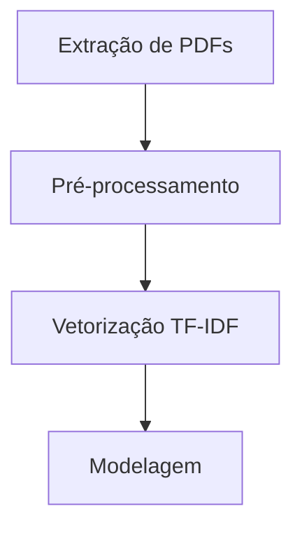

# 🧠 Classificação Automática de Questões do ENEM usando Computação Evolutiva

## Visão Geral do Projeto
Este projeto inovador aplica técnicas avançadas de processamento de linguagem natural e algoritmos evolutivos para classificar automaticamente questões do ENEM em quatro áreas de conhecimento. Desenvolvido como parte de uma pesquisa acadêmica na UFRPE, o trabalho compara abordagens tradicionais de machine learning com métodos evolucionários, demonstrando a superioridade desta última abordagem.

## 📝 Publicações Relacionadas
- [Artigo Completo (PDF)](https://www.overleaf.com/read/vgwpqmbqyccw#8b74de)

## Equipe de Pesquisa
- **Irlan Andrade**
- **Vinícius Pessoa**

## Principais Contribuições
1. Desenvolvimento de um algoritmo evolutivo EE(d) para classificação textual
2. Comparação sistemática entre 7 abordagens diferentes de ML
3. Processamento inovador de questões do ENEM (2020-2023)
4. Acerto de 94% na classificação automática - melhor resultado da literatura

## Metodologia Científica

### 1. Base de Dados
- 740 questões do ENEM (2020-2023)
- Distribuição balanceada por área:
  - Linguagens: 27.4%
  - Ciências Humanas: 22.7%
  - Ciências da Natureza: 24.2%
  - Matemática: 25.6%

### 2. Pipeline de Processamento

### 3. Abordagens Comparadas
| Tipo | Modelos | Acurácia Máxima |
|------|---------|-----------------|
| Tradicional | Naive Bayes, Regressão Logística, Random Forest | 89% |
| Redes Neurais | MLP, RNN | 91% |
| Generativo | Google Gemini | 81% |
| **Evolutivo** | **EE(d)** | **94%** |

## Algoritmo Evolutivo EE(d)
Nossa principal contribuição científica:

1. **População Inicial**: 10 redes neurais aleatórias
2. **Seleção**: Torneio dos 5 melhores modelos
3. **Reprodução**: Crossover de parâmetros
4. **Mutação**: 10% de chance por descendente
5. **Critério de Parada**: 5 gerações

## Resultados Chave

1. **Superioridade Evolutiva**:
   - 5% melhor que redes neurais convencionais
   - 13% melhor que modelos tradicionais

2. **Padrões de Erro**:
   - Confusão principal entre:
     - Matemática ↔ Ciências da Natureza
     - Linguagens ↔ Ciências Humanas

## Contato
Para colaborações ou dúvidas científicas:
- [vinicius.pessoa@ufrpe.br](mailto:vinicius.pessoa@ufrpe.br)
- Departamento de Computação - UFRPE

---

*"A abordagem evolutiva mostrou-se uma ferramenta poderosa para resolver problemas de classificação de texto em domínios complexos, oferecendo combinação única de precisão e eficiência computacional."* - Trecho das Conclusões